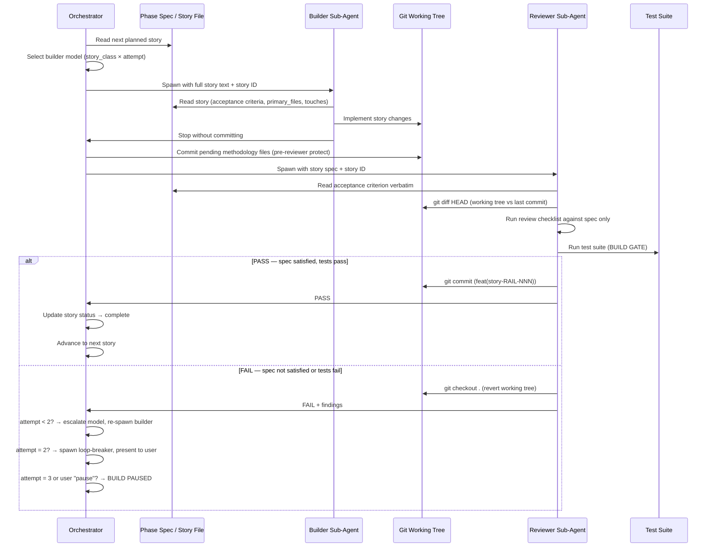

# Builder/Reviewer Sub-Agent Loop

> **One-line intent:** A closed spec→build→review loop where builder and reviewer are separate sub-agents whose only shared authority is the story spec, ensuring every committed change is provably tied to recorded intent.

## Pattern in 60 Seconds

**The problem:** An AI agent writes code, reviews its own output, and commits — with no external anchor on what "correct" means. The agent drifts toward taste, silently accepts half-finished work, or enforces criteria it invented mid-session.

**The insight:** Separating the builder and the reviewer into two independent sub-agents — both reading from the same pre-written spec — eliminates the self-review bias. The reviewer's only authority is the spec; it cannot add scope, cannot apply taste, and cannot sign off on work the spec does not describe.

**The key structure:**

| Role | Authority | Constraint |
|------|-----------|------------|
| **Orchestrator** | Reads the phase spec; decides which story is next; spawns builder and reviewer | Does not write code; does not review code |
| **Builder sub-agent** | Implements the story exactly as specified; stops without committing | Cannot approve its own work |
| **Reviewer sub-agent** | Diffs the working tree against the spec; runs tests; commits (PASS) or reverts (FAIL) | Cannot expand scope; cannot apply criteria not in the spec |

**What broke when we got this wrong:** The context budget check in the flex project was enforced only by the LLM reading a doc at session start and "remembering" to apply it every iteration. The LLM moved quickly through stories, skipped the check, context bloated past the 120k-token threshold, and the prompt that should have appeared at story boundaries never fired. "The architect of the rule cannot reliably follow it." (CER-027, 2026-05-29.) The pattern's mechanical enforcement layer — a pre-tool-use hook — was introduced precisely because attention-based enforcement of the loop's own rules is the canonical failure mode this pattern exists to prevent.

---

## Classification

| Property | Value |
|----------|-------|
| **Category** | Agentic Architecture |
| **Difficulty** | Advanced |
| **Also Known As** | Spec-Gated Review Loop, Closed-Loop QA Sub-Agent, Reviewer-As-Spec-Enforcer |

---

## Motivation

Imagine you ask an AI agent to implement a feature. The agent writes the code, runs a quick look-over, pronounces it "looks good," and commits. What did it check against? Its own judgment about what good code looks like. There is no external anchor.

Now extend this across dozens of stories in a multi-week project. Each commit reflects the agent's taste in that session — what it happened to consider complete, what test coverage seemed sufficient, whether it remembered the architectural rule from five sessions ago. The human reviewing git history sees commits that describe features. What they cannot see is which commits drifted from the spec, which ones silently skipped acceptance criteria, which ones added scope the operator never approved.

The naive fix is to give the agent a checklist. This works until the agent skips the checklist under time pressure, or interprets checklist items loosely, or adds items it thinks "should" be there. The checklist is still enforced by the same agent that wrote the code — still no external anchor.

The Builder/Reviewer Sub-Agent Loop solves this by separating the writing from the judging, and by giving the judge exactly one source of authority: the pre-written spec. The reviewer sub-agent reads the story file (the "spec" — a structured description of what must be true when the story is complete, written before any code is written), diffs the working tree against it, runs the declared test suite, and makes a binary decision: PASS (commit) or FAIL (revert). It cannot decide "close enough." It cannot add a requirement it thought of mid-review. The spec is fixed at story-start; the reviewer enforces it literally.

In the flex project (a Claude Code plugin used across 7 downstream software projects), this pattern has been running on every code story from Phase 10 through Phase 47 — over 130 stories. The failure modes the pattern guards against are documented as CER (Continuous Engineering Review) entries: CER-027 (attention-based enforcement collapse) and CER-028 (reviewer checking different conditions than the spec required because there was no single canonical artifact both sides read).

---

## Applicability

Use this pattern when:
- An AI agent is generating code or significant artifacts from a pre-written spec
- The spec (story file, phase doc, or acceptance criteria) is the canonical source of truth for what "done" means
- You want every committed change to be provably tied to recorded intent
- The project spans multiple sessions or multiple agents (spec continuity matters)
- Taste-based or opinion-based gate failures have occurred or are a concern
- You need an audit trail of what was built vs. what was specified

Do NOT use this pattern when:
- There is no pre-existing spec — the pattern requires acceptance criteria that exist before the builder starts
- Tasks are exploratory or research-oriented with no verifiable acceptance criteria
- The build loop overhead (two sub-agent spawns per story) exceeds the value of spec enforcement (appropriate for tiny one-off scripts where a human reviews the diff directly)
- The artifact cannot be mechanically verified against the spec (e.g., aesthetic output where "correct" is subjective)

---

## Structure



The orchestrator is the only participant that persists across the full loop. The builder and reviewer are ephemeral sub-agents: they spawn, execute, and return. Their shared source of truth is the story file, not each other's output or any in-session context.

---

## Participants

| Participant | Role | Example |
|------------|------|---------|
| Orchestrator | Manages the loop: reads the phase spec, selects the next story, spawns sub-agents in sequence, handles results, escalates on failure | flex's `CLAUDE.build.md` orchestrator; the Claude Code session that drives each build turn |
| Phase spec | Living document containing the goal, story table (with statuses), and working principles for a phase of work. A "phase" is a named unit of work — equivalent to a sprint or milestone. The spec is written before any story is built. | `docs/phases/phase-48.md` — contains NP-1 through NP-6 story definitions and all acceptance criteria |
| Story file | The per-story spec: a structured YAML-frontmatter Markdown file declaring the story ID, status, `primary_files` (files the builder may write), `touches` (files the builder may read but not own), and the acceptance criterion. A "story" is the atomic unit of work in this pattern. | `docs/stories/PATTERNS/PATTERNS-001.md` — declares exactly what must be true when this story is complete |
| Builder sub-agent | Reads the story file, implements the changes declared in `primary_files`, and stops without committing. Has write access to declared files only. | A `claude-sonnet-4-6` subagent spawned with the story text; implements the pattern doc and stops |
| Reviewer sub-agent | Reads the story spec, diffs the working tree, runs the review checklist against the spec (not opinion), runs the test suite (BUILD GATE), and commits or reverts. | A `claude-sonnet-4-6` subagent spawned after the builder; enforces the checklist in `CLAUDE.md` against CER-028's acceptance criteria |
| BUILD GATE | The test suite invocation that the reviewer runs before committing. A story is not complete until the BUILD GATE passes. The gate command is declared in the project's build instructions and is the same command for every story. | `PATH=$HOME/.local/bin:$PATH uv run pytest tests/pairmode/ -x -q` — flex's BUILD GATE |
| Loop-breaker | A third sub-agent invoked only after two consecutive FAIL outcomes on the same story. Its sole job is cold-eyes diagnosis: ignore both previous approaches, analyse the error from first principles, and propose one alternative. It does not implement. | Invoked with `LOOP-BREAKER: [reviewer finding] | FILE: [file:line] | TRIED: [what failed]` |
| Effort DB | A SQLite database (`effort.db`) tracking token cost, duration, model, outcome, and story metadata for every builder and reviewer invocation. Used by the context budget hook to project whether the next sub-agent spawn will fit within the session context window. | `.companion/effort.db` — queried by `context_budget.py` before each Task spawn |

---

## How It Works

1. **Orchestrator reads the phase spec** and identifies the next story with status `planned` in the Stories table.

2. **Model selection.** Before spawning the builder, the orchestrator calls `select_builder_model` with the story's `story_class` and current attempt number. For a `methodology` story (like a pattern doc), the baseline model is Sonnet; for a complex `code` story (≥5 primary files or a protected file in scope), the orchestrator prompts the user before upgrading to Opus.

3. **Pre-story schema gate.** If the story introduces a new persistent schema object (database table, migration), the orchestrator verifies a management surface exists in the same phase. If not, the loop is paused until the user adds a management UI story or declares an explicit exception. This enforces the "Conceptual Rebuild Completeness" rule.

4. **Orchestrator spawns the builder sub-agent** with the complete story text verbatim (not paraphrased), the story ID, and a summary of recent git commits. The builder's write access is pre-authorized to only the files listed in the story's `primary_files` and `touches` declarations — no other files can be written without a permission prompt.

5. **Builder implements and stops.** The builder reads the acceptance criterion, implements the changes, and returns to the orchestrator without committing. If the builder encounters a DEVELOPER ACTION gate (an instruction requiring human input) or cannot resolve an error after two self-attempts, it stops and the orchestrator surfaces a BUILD PAUSED message.

6. **Pre-reviewer methodology commit.** Before spawning the reviewer, the orchestrator commits any pending orchestrator-side files (story status updates, phase doc edits, CER entries). This is load-bearing: the reviewer's revert path (`git checkout .`) restores the working tree to HEAD — without this commit, uncommitted methodology files are silently erased on FAIL.

7. **Orchestrator spawns the reviewer sub-agent** with the story ID, the acceptance criterion verbatim, and the model returned by `select_reviewer_model` (Sonnet at attempt 1; Opus at attempt 2+).

8. **Reviewer runs the checklist against the spec only.** Each item in the review checklist is evaluated against what the spec says must be true — not against what the reviewer thinks "should" be true. Items the spec does not mention are not checked. The reviewer has read-only tools plus Bash; it cannot write to spec files or protected infrastructure.

9. **Reviewer runs the BUILD GATE.** The test suite must pass. A story with a failing BUILD GATE is a FAIL regardless of all other checklist items.

10. **PASS path:** Reviewer commits with `feat(story-RAIL-NNN)` format, returns PASS to the orchestrator. The orchestrator updates the story status to `complete` in the story file, records the attempt in the effort DB, and advances to the next story.

11. **FAIL path, attempt 1:** Reviewer reverts the working tree (`git checkout .`), returns FAIL with findings. Orchestrator appends findings as `## PREVIOUS ATTEMPT FAILED` to the story prompt, escalates the builder model (Sonnet → Opus for `code` stories), and re-spawns the builder as attempt 2. No user pause.

12. **FAIL path, attempt 2:** Orchestrator spawns the loop-breaker sub-agent immediately. The loop-breaker analyses from first principles and proposes one alternative approach. Orchestrator presents the proposal to the user: "proceed" spawns builder attempt 3 with the loop-breaker's guidance appended; "pause" stops the loop.

13. **FAIL path, attempt 3:** BUILD PAUSED — loop stops, working tree is clean at HEAD, and the user resolves manually before saying "Continue building."

14. **Context budget check (between stories).** Mechanically enforced by a `pre_tool_use` hook that intercepts sub-agent Task/Agent spawns whose `subagent_type` is a pairmode build-cycle agent (`builder`, `reviewer`, `loop-breaker`, `security-auditor`, `intent-reviewer` — INFRA-199; general-purpose/Plan/Explore spawns pass through ungated). The hook calls `context_budget.py`, which queries the effort DB for the current session's projected next-step token cost. If the projection exceeds the threshold (default: 120k tokens × 1.10 overrun factor), the spawn is blocked and the orchestrator presents the budget prompt verbatim. The user chooses to proceed or to `/clear` and resume in a fresh session.

### Configuration Example

The orchestrator's decision table for model selection (from `CLAUDE.build.md`):

```markdown
| story_class  | complexity signal                        | attempt | builder model | reason           |
|--------------|------------------------------------------|---------|---------------|------------------|
| doc          | any                                      | any     | haiku         | auto-downgrade   |
| methodology  | any                                      | any     | sonnet        | auto-baseline    |
| code         | < 5 primary_files, no protected file     | 1       | sonnet        | auto-baseline    |
| code         | ≥ 5 primary_files OR protected file      | 1       | opus          | prompted-upgrade |
| code         | any                                      | ≥ 2     | opus          | retry-upgrade    |
```

The story file format (YAML frontmatter + Markdown):

```yaml
---
id: PATTERNS-001
phase: '48'
rail: PATTERNS
story_class: methodology
status: planned
primary_files:
  - docs/patterns/agentic-architecture/builder-reviewer-sub-agent-loop.md
touches: []
---

# PATTERNS-001 — Draft "Builder/Reviewer Sub-Agent Loop" pattern doc

## Acceptance criterion

`docs/patterns/agentic-architecture/builder-reviewer-sub-agent-loop.md` exists
and follows the cloudnirvana/open-patterns catalog template verbatim. All
mandatory sections are present and filled in with real, project-specific content.
No placeholder text remaining. "What Broke in Practice" and "Security Implications"
are both filled in. No flex-internal jargon appears without an inline definition.
```

The `rail` field groups stories by architectural domain (e.g., `INFRA`, `PATTERNS`, `UI`). The `primary_files` and `touches` declarations are the permission boundary: the orchestrator pre-authorizes writes to these paths before spawning the builder, and no file outside this list can be written without a user prompt.

---

## Consequences

### Benefits
- **Scope creep eliminated.** The reviewer is bound to the spec. It cannot add requirements it thought of mid-review; it cannot accept work that the spec does not describe as done.
- **Opinion drift eliminated.** Two different reviewer sessions on the same story produce the same verdict because both read the same spec.
- **Every commit is auditable.** The git log contains `feat(story-RAIL-NNN)` commits. Each commit has exactly one source of truth: the story file at that ID. An auditor can reconstruct what was intended, what was implemented, and whether the reviewer passed it.
- **Model escalation recovers most failures automatically.** The Sonnet→Opus escalation on attempt 2 resolves the majority of FAIL outcomes without human intervention, because most first-attempt failures are ambiguity or complexity failures, not fundamental spec problems.
- **Context budget is enforced mechanically.** The hook-based context check prevents the pattern's own enforcement from collapsing under token pressure (the canonical failure mode described in CER-027).
- **Loop-breaker prevents infinite retry churn.** Rather than spawning a third identical attempt, the loop-breaker forces a fresh perspective. In practice this breaks the majority of loops that reach attempt 2.

### Liabilities
- **Requires a pre-existing spec.** The pattern cannot start without acceptance criteria written before the builder spawns. Projects that generate requirements and implementation in the same agent turn cannot use this pattern.
- **Loop overhead per story.** Every story requires at minimum two sub-agent spawns (builder + reviewer). For a 10-story phase, this is 20+ spawns before counting retries.
- **Reviewer can only enforce what is in the spec.** If the spec is ambiguous, the reviewer enforces the ambiguity. If the spec is wrong, the reviewer enforces the wrong thing. Spec quality is the ceiling of this pattern's correctness guarantee.
- **Pre-reviewer methodology commit is load-bearing and easy to miss.** If the orchestrator forgets Step 6 (committing methodology files before spawning the reviewer), a FAIL revert silently erases story status updates, CER entries, and lesson notes that were never committed.
- **Loop-breaker does not fix broken specs.** When the root cause of two consecutive FAIL outcomes is a spec problem (ambiguous acceptance criterion, missing context), the loop-breaker proposes implementation alternatives that cannot succeed. These cases require human intervention.

### What Broke in Practice

**CER-027 — Attention-based context enforcement collapse (2026-05-29, Phase 47).** The flex project's canonical build loop required the orchestrator to run `/context` between every story and compare the token count against a 120k-token threshold. This rule was written in `CLAUDE.build.md` and expected the orchestrator (an LLM session) to honor it on every iteration. Confirmed failure mode: the orchestrator moved quickly through stories, skipped the check, context bloated past threshold, and the compaction prompt that should have appeared at story boundaries (specifically between UI-013 and UI-014) never fired. The session continued into a state where mid-story compaction was likely, risking in-flight work loss. Resolution: the check was re-implemented as a `pre_tool_use` hook that mechanically intercepts every Task spawn, calling `context_budget.py` to evaluate the projected cost. The LLM attention layer was removed entirely. Lesson: any rule that the pattern's own loop must follow — especially safety or budget rules — cannot be enforced by the same LLM following the rule. Mechanical enforcement (hooks, blocking tools) is required.

**CER-028 — BUILD GATE variable inconsistency (2026-05-29, Phase 47).** The two canonical templates that power the pattern (`CLAUDE.md.j2` and `reviewer.md.j2`) used different template variables for the BUILD GATE command: `{{ build_command }}` in the orchestrator template and `{{ test_command }}` in the reviewer template. In a downstream project (forqsite), these resolved to different commands: `build_command = "pnpm build && pnpm typecheck && pnpm test"` vs. `test_command = "pnpm test"`. The reviewer was checking a strictly weaker gate than the spec required. Neither command was wrong, but the reviewer could pass a story that would fail a full build. This is precisely the failure mode the pattern exists to prevent: the reviewer checking different conditions than the spec required, because there was no single spec artifact both sides read for the gate definition.

**Taste-based scope creep in early flex phases (Phases 1–9, before methodology formalization).** Before the pattern was formalized, reviewer sub-agents applied their own judgment about code quality, added requirements not in the story spec, and rejected working implementations for stylistic reasons. Human review of the git history showed commits being reverted and re-attempted two to three times for reasons that had no connection to the story's acceptance criterion. Formalizing the "reviewer's only authority is the spec" constraint eliminated this class of failure.

---

## Implementation Notes

### Variations

**Single-agent mode (no sub-agents).** When the target environment does not support spawning sub-agents (e.g., a simpler API caller), the pattern degrades to a single agent that implements, then switches roles and reviews against the spec before committing. This preserves the spec-as-authority constraint but loses the independence guarantee — the same model that built the feature also reviews it. Viable for low-stakes or exploratory work; not recommended for production stories.

**Async reviewer.** The reviewer does not need to be spawned immediately after the builder. An orchestrator managing multiple stories in parallel can spawn builders for stories A and B, then spawn reviewers for both once the builders return. The spec-as-authority constraint holds; the loop is just pipelined.

**Human-in-the-loop as reviewer.** The pattern does not require both reviewers to be AI agents. The spec-as-authority constraint applies equally to human reviewers: the human reads the acceptance criterion and verifies the working tree against it, then approves or rejects. The git commit convention (`feat(story-RAIL-NNN)`) and the story status update are the same.

**Effort DB seeded prior.** The context budget hook can be cold-started on a new project using a cross-project seed file (`effort_baseline.json`) that provides a prior estimate of token cost per story class. Once the project accumulates ≥5 attempts, the hook switches from the prior to a per-phase median. This allows new projects to benefit from cross-project learning without a data collection phase.

### Common Pitfalls

**Skipping the pre-reviewer methodology commit.** The most reliably missed step. The reviewer's FAIL path reverts the working tree to HEAD. If the orchestrator has made story-status or CER updates since the last commit, they are gone. Automate this step or add it to a pre-reviewer checklist.

**Writing acceptance criteria that are not verifiable.** "The implementation should be clean and well-organized" cannot be reviewed against a spec. Acceptance criteria must be binary: either the file exists at the declared path, or it doesn't; either the test passes, or it doesn't; either the schema change is in the migration, or it isn't. Ambiguous criteria produce either false PASSes (reviewer interprets loosely) or false FAILes (reviewer interprets strictly).

**Declaring too-wide a scope in `primary_files`.** Every file in `primary_files` is pre-authorized for the builder. An overly broad declaration (e.g., `docs/**`) gives the builder write access to the entire documentation tree. The correct discipline: declare only the specific files this story creates or modifies.

**Using the reviewer to expand the spec.** A reviewer that returns FAIL with "this implementation would be better if it also did X" is a spec author, not a reviewer. The reviewer's findings must be grounded in the acceptance criterion, not in the reviewer's preferences. If the reviewer surfaces legitimate gaps in the spec, the correct path is: FAIL this story, update the spec, re-run the builder.

---

## Security Implications

### Attack Surface

- The builder sub-agent has pre-authorized write access to exactly the files declared in the story's `primary_files` and `touches`. Files outside these declarations require a user permission prompt. A builder that attempts to write outside its declared scope is surfaced immediately.
- The reviewer sub-agent has read-only tools plus Bash. It cannot write to spec files, protected infrastructure files (hooks, plugin manifests), or the effort DB. Its only write path is `git commit` (PASS) or `git checkout .` (FAIL).
- The pre-tool-use hook that enforces the context budget has read-only access to the effort DB and the session transcript. It emits a block decision via stdout; it does not write to any project file.

### Data Sensitivity

- Story files and phase docs contain project decision history, architectural rationale, CER (Continuous Engineering Review — a structured log of engineering findings and their dispositions) entries, and effort data. These are internal project artifacts; treat as internal confidential.
- The effort DB (`effort.db`) contains token cost, duration, model selection, and outcome records for every build and review invocation. This data is local to the project filesystem. No data leaves the host.
- Builder sub-agents may read source code in the project's declared scope. The permission system (pre-authorized writes, user prompts for anything outside declared scope) limits the blast radius of a misbehaving builder.

### Failure Modes

- **Builder escapes declared scope.** A builder that modifies files outside `primary_files` and `touches` triggers a user permission prompt. If the user approves the out-of-scope write, the reviewer's RAIL SCOPE check (checklist item 9 in `CLAUDE.md`) flags the undeclared file as MEDIUM severity, blocking the PASS commit. The defense is two-layer: permission system at write time, reviewer checklist at commit time.
- **Reviewer is given falsified spec.** If the orchestrator passes a modified acceptance criterion to the reviewer (different from the story file), the reviewer enforces the falsified spec. The mitigation is: the orchestrator always passes the story ID, not a paraphrased version of the criterion, and the reviewer reads the story file directly by ID.
- **Context budget hook disabled.** If the pre-tool-use hook is removed or misconfigured, the mechanical context check falls back to the attention-based enforcement that CER-027 proved unreliable. The hook's presence must be verified at project setup (bootstrap) and at each phase checkpoint.
- **Loop-breaker called with a spec problem.** If two consecutive FAILs are caused by a wrong spec (not a wrong implementation), the loop-breaker proposes implementation alternatives that cannot succeed. The blast radius is three failed attempts and a BUILD PAUSED — no data loss, no committed incorrect code. The human resolves by updating the spec.

### Mitigations

- Pre-authorized write permissions are story-scoped and cleared after each story completes (`flex_build.py clear-permissions`). A permission granted for story N is not inherited by story N+1.
- Protected files (hooks, plugin manifests, sidebar scripts) are declared in the project's permission configuration as a catastrophic denylist. The reviewer cannot modify these files even if the story's `touches` declaration includes them.
- The reviewer's FAIL path (`git checkout .`) is not destructive to committed history — it only reverts uncommitted working tree changes. A reviewer cannot erase work that has already been committed.
- The context budget hook emits a blocking decision but does not modify any project file. Its failure mode is permissive (if the hook errors, it defaults to allowing the spawn), which means a broken hook causes context overrun risk (the CER-027 failure mode) rather than a hard loop block.

---

## Known Uses

| Organization | Context | Scale |
|-------------|---------|-------|
| flex project (david@halfhorse.com) | Used on every code story from Phase 10 through Phase 47 across the flex codebase and 7 downstream projects (forqsite, radar, asp, aab, cora, and others). The pattern is the primary methodology by which flex ships: no code story is committed without a reviewer sub-agent signing off against the story spec. CER-027 and CER-028 are the two documented production failures that led to the current mechanical enforcement layer. | Single operator + AI agents; 130+ stories across 47 phases |

---

## Related Patterns

| Pattern | Relationship |
|---------|-------------|
| `checkpoint-gated-autonomy` | The BUILD GATE in this pattern is the autonomy checkpoint: the reviewer cannot commit without the gate passing, and the agent cannot proceed to the next story without a reviewer commit. The difference: `checkpoint-gated-autonomy` decouples an agent session from a human approval decision using durable checkpoint files; this pattern couples two agent sessions (builder and reviewer) to a shared spec artifact, with no human in the inner loop. |
| `hub-and-spoke-orchestration` | The orchestrator in this pattern is the hub; the builder and reviewer are spokes. `hub-and-spoke-orchestration` describes the routing architecture; this pattern describes the spec-gated QA discipline running on top of it. They are composable. |
| `quality-gate-checkpoint` | Superficially similar name, different scope. `quality-gate-checkpoint` addresses a single agent self-reviewing a draft artifact (e.g., an email) before human approval — the agent checks its own work against structural rules before presenting. This pattern addresses two *separate* sub-agents running a closed software development loop where the spec is the sole authority — the reviewer is independent of the builder, and the loop exits only when the reviewer commits. The distinction matters: self-review can still reflect the builder's taste; this pattern's independence guarantee cannot. |
| `runbook-driven-agent-cadence` | Both patterns separate the spec (what to do) from the execution (doing it). In `runbook-driven-agent-cadence`, the spec is an operational runbook describing recurring actions. In this pattern, the spec is a story file describing a one-time software change with binary acceptance criteria. The loop mechanics (spawn builder, spawn reviewer) are specific to this pattern; runbook-driven cadence does not require a reviewer. |
| `canonical-source-over-recall` | Sub-agent pass-by-reference is a direct instantiation of this pattern: the orchestrator passes a file path rather than a copied value so the sub-agent reads the canonical file at spawn time rather than inheriting the orchestrator's potentially stale context. |

---

## Metadata

| Property | Value |
|----------|-------|
| **Contributor** | David Jacobsen, flex project (david@halfhorse.com) |
| **Production Environment** | macOS/Linux, Claude Code CLI, Anthropic Claude (Sonnet/Opus), Python/uv, SQLite |
| **First Published** | 2026-06-01 |
| **Last Updated** | 2026-06-01 |
| **Cloud Nirvana Event** | — |
| **License** | CC BY 4.0 |

---

## Revision History

| Date | Change | Author |
|------|--------|--------|
| 2026-06-01 | Initial publication | David Jacobsen / flex project |
