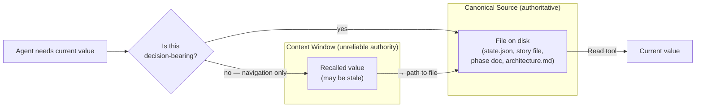

# Source of Truth over Recall

> **One-line intent:** Agents must read canonical source files rather than inferring from context — recall tells you *where* to look; the file tells you *what's true* — preventing the class of errors where agents act on stale, compacted, or confabulated state.

## Pattern in 60 Seconds

**The problem:** A long-running AI agent accumulates state in its context window across many tool calls and session turns. When it needs a fact — a file path, a version number, an architectural rule, a story's completion status — it reaches into that accumulated context rather than reading the authoritative file. The context was accurate when it was populated. It may not be accurate now.

**The insight:** There are two kinds of agent memory: *navigational* (where to find data) and *authoritative* (what that data actually says). The context window is reliable for navigation — "there is a story file at `docs/stories/PATTERNS/PATTERNS-006.md`." It is unreliable as the authority — "that story is planned, not complete." The file is the authority. Recall is navigation to the file, not a substitute for reading it.

| Memory type | Appropriate use | Failure mode |
|-------------|----------------|--------------|
| **Context recall** | Find the path; know a file exists; remember the general shape of a rule | Citing stale values; acting on compacted/summarized data; reporting completion without verification |
| **Canonical file read** | Get the current value; verify completion; confirm a rule's current text | N/A — the file is the authority |

**What broke when we got this wrong:** In the flex project (a Claude Code plugin), an orchestrator agent ran `/context` once at session start to read the context budget threshold from `.companion/state.json`. Later in the session, after context compaction had occurred, the agent reported the threshold value from recall rather than re-reading `state.json`. The recalled value was the pre-compaction figure — the compaction summary had not preserved the exact numeric field. The agent blocked a story spawn it should not have blocked. The fix was to require a fresh read of `state.json` at each enforcement decision rather than trusting a session-cached value. (Operator observation, 2026-05-31, flex Phase 47.)

---

## Classification

| Property | Value |
|----------|-------|
| **Category** | Agentic Architecture |
| **Difficulty** | Intermediate |
| **Also Known As** | Canonical Source Discipline, File-Authoritative Recall, Anti-Hallucination Source Anchor |

---

## Motivation

Imagine an agent that has been working in a codebase for 200k tokens. It read `docs/architecture.md` at the start of the session — at line 424, there was a key schema definition. Forty tool calls later, it needs that definition again. It does not re-read the file. It recalls line 424 from context.

What the agent does not know: the doc was modified by a story mid-session. Line 424 now contains a different definition. The schema the agent believes is correct is three versions stale.

This is not hallucination in the conventional sense. The agent is not inventing a fact. It is accurately recalling a *prior state* of a fact that has since changed. The recalled value was true. It is no longer true. But the agent's context does not mark it as stale — context is append-only in the direction of time.

The same failure applies to:
- **Story status**: An agent recalls "PATTERNS-005 was completed in the last loop" rather than reading the story file's `status` field.
- **Configuration values**: An agent recalls a token threshold from session context rather than reading `.companion/state.json`.
- **Phase docs**: An agent reports a phase as "in progress" because it remembers the phase being opened, without verifying whether it was later paused or completed.
- **Architectural rules**: An agent cites `docs/architecture.md` at stale line numbers or from removed sections, because it read the doc once at session start.

The common thread: the agent is treating the context window as a reliable database query. It is not. Context is a log. The file is the database.

In the flex project, which runs a multi-phase builder/reviewer loop across many downstream software projects, this failure class was observed repeatedly before being formally named. The catalyst was CER-027 (context budget enforcement collapse), where the orchestrator agent "remembered" applying a rule it had skipped, because its context contained evidence of the rule being applied in earlier sessions — the compaction summary had blended past and present behavior.

---

## Applicability

Use this pattern when:
- An agent operates across long sessions where context compaction has occurred or is likely
- Canonical source files (config files, state files, spec files, phase docs, story files) change during the session
- The agent needs to make decisions based on the *current* value of a field, not its value when first read
- Agents report status ("this story is complete," "the phase is in progress") that must reflect the file, not memory
- Multiple agents may be reading and writing shared canonical files (one agent's write may invalidate another's recall)

Do NOT use this pattern when:
- The file is append-only and the agent needs only the last-written value (a pure event log where "current" means "most recent entry" and the agent is the only writer in-session)
- The agent is performing a pure read-only analytical pass and no file will change during its execution window
- The read cost (token + latency) exceeds the stakes of a stale value (e.g., reading a large binary just to confirm a filename that has not changed in 6 months)

---

## Structure



The key insight in the diagram: recall is a pointer to the file, not a copy of the file. When making a decision that depends on the value being current, always dereference the pointer.

---

## Participants

| Participant | Role | Example |
|------------|------|---------|
| Canonical source file | The authoritative record of a value or state. Written by a single designated writer; read by agents at decision time. | `.companion/state.json` (runtime config), `docs/stories/PATTERNS/PATTERNS-006.md` (story status), `docs/phases/phase-48.md` (phase progress) |
| Agent context window | Navigational memory: the agent knows files exist and their general shape. Unreliable as an authority on current values after compaction or concurrent writes. | The LLM session transcript; in-context summaries; compacted context |
| Reader agent | Any sub-agent (orchestrator, builder, reviewer) that needs a current value. Must read the canonical file at decision time, not recall from context. | The orchestrator reading `state.json` before each story spawn; the reviewer reading the story file before enforcing the acceptance criterion |
| Writer agent | The designated agent that updates the canonical file. Writes are the authority; readers must read after writes, not before. | The orchestrator updating story status after a PASS commit; `context_budget.py` writing `context_budget_acknowledged_at` back to `state.json` |
| Decision point | The moment where a current value determines a consequential action — spawning a sub-agent, committing code, reporting a status, applying a threshold. | Checking whether a story is `planned` before spawning a builder; reading a threshold before deciding whether to block a spawn |

---

## How It Works

1. **Classify the use before acting.** Before using a value from context, ask: is this navigational ("there is a state.json at `.companion/`") or authoritative ("the threshold in state.json is 120000")? Navigation can come from context. Authority must come from the file.

2. **Read at decision time, not session start.** Configuration values, status fields, and rule text should be read immediately before the decision that depends on them — not once at session start and then held in context for subsequent decisions. The file is cheap to re-read. The cost of a stale decision is not.

3. **Never report completion without verifying the file.** An agent reporting "story PATTERNS-005 is complete" must have read `status: complete` from the story file's frontmatter in the current tool call. "I remember it being completed earlier" is not sufficient.

4. **Treat compaction events as invalidating all recalled values.** After any context compaction — auto-compaction, `/clear`, or sub-agent spawn (which starts a fresh context window) — all values recalled from the pre-compaction context should be considered unverified until re-read from their canonical files.

5. **Canonical files are the write target for updates.** When an agent updates state (story status, acknowledged-at timestamps, CER entries), it writes to the canonical file, not to an in-context variable. Other agents reading that state read the file, not an in-session broadcast.

### Configuration Example

The flex project's `context_budget.py` enforces this pattern mechanically. The module reads `.companion/state.json` fresh on every invocation rather than caching the threshold across calls:

```python
# Correct: read at decision time
def decide(project_dir: Path, transcript_tokens: int) -> BudgetDecision:
    state = _read_state_json(project_dir)          # fresh read every call
    threshold = state.get("context_budget_threshold", DEFAULT_THRESHOLD)
    ...

# What broke before: threshold was read once at session start and held in context
# After compaction, the agent recalled the pre-compaction value
```

The reviewer sub-agent in the builder/reviewer loop (see the Builder/Reviewer Sub-Agent Loop pattern) is spawned with the story ID — not with the acceptance criterion text copied from the orchestrator's context. The reviewer reads the story file by ID:

```bash
# Correct: reviewer reads the story file directly
cat docs/stories/PATTERNS/PATTERNS-006.md

# What breaks without this: orchestrator paraphrases the criterion from memory,
# reviewer enforces a paraphrase of a paraphrase, not the canonical acceptance criterion
```

---

## Consequences

### Benefits
- **Decisions are based on current state, not prior state.** A reader agent cannot act on a value that was correct at session start but has since been updated by a writer agent.
- **Compaction events are safe.** After context compaction, the agent loses in-context data but not the ability to re-read it from canonical files. The degradation is navigational (the agent may not know what to look for) rather than authoritative (the agent has a wrong value it believes to be correct).
- **Sub-agent spawns do not inherit stale context.** Each sub-agent starts with a fresh context window. If the orchestrator passes a value by reference (path + instruction to read the file) rather than by value (copied text from its own context), the sub-agent reads the current state.
- **Auditability is preserved.** The canonical file is the record of what the system believed at any point. An auditor reading `docs/stories/PATTERNS/PATTERNS-006.md` sees the authoritative status, not whatever a long-running agent happened to recall.

### Liabilities
- **Read cost at every decision point.** Each canonical file read is a tool call with associated token cost. In tight context windows, this is non-trivial. The countermeasure is to batch reads at the start of a decision-bearing sequence, not to cache across unrelated decisions.
- **Requires discipline from agent authors.** Unlike a hook or a mechanical check, this pattern depends on agent prompts and instructions being written with explicit "read the file" directives at decision points. An agent prompt that says "check whether the story is complete" without naming the tool call is ambiguous — the agent may check its context rather than reading the file.
- **Navigation and authority can be confused.** The pattern requires agents to correctly classify uses as navigational or authoritative. An agent that over-classifies (reads every file reference as authoritative) will make unnecessary tool calls. An agent that under-classifies (treats most uses as navigational) will silently act on stale values.

### What Broke in Practice

**context_budget.py stale threshold (2026-05-31, flex Phase 47).** The context budget threshold is stored in `.companion/state.json`. In an early implementation, the orchestrator agent read the threshold at session start and held it in context across stories. After context compaction occurred mid-session, the compaction summary preserved the threshold field imprecisely (rounding the numeric value). Subsequent enforcement decisions used the compacted value. One story spawn was blocked at 118k tokens because the agent recalled a threshold of 115k (the compacted summary figure) rather than the file's actual value of 120k. Resolution: `context_budget.py` was rewritten to read `state.json` on every invocation, making the file the sole authority for the threshold value.

**Architecture.md stale claim (L015, Phase 24, flex project).** An external cold-eyes review (Continuous Engineering Review — a structured log of findings and their dispositions — CER entry CER-015) found that `docs/architecture.md` claimed 58 rows in the `role_permissions` seed, while the actual seed file contained 56 rows. The discrepancy had accumulated across two migrations (0050 and 0052) where the code was updated correctly but the agent updating each migration did not re-read `architecture.md` to verify its claims were still accurate — it recalled the doc's content from context and judged no update was needed. An agent reading `architecture.md` cold three months later would be misled. Resolution (L015 lesson): the reviewer checklist was extended to check any doc in `docs/` that references code touched by the story, not only `README.md`.

**Story completion by recall (operator observation, flex Phase 46).** An orchestrator agent reported PATTERNS-004 as `complete` in a session summary after a context compaction event. When the next session started, the operator read the story file directly and found `status: planned` — the story had never been built. The orchestrator had recalled the story as complete because it had discussed the story extensively in a pre-compaction turn. The discussion was not a build. Resolution: the build methodology was updated to require the orchestrator to read the story file's `status` field before each loop iteration, not to infer status from conversation history.

---

## Implementation Notes

### Variations

**Explicit read directives in agent prompts.** Rather than trusting agents to self-classify navigational vs. authoritative uses, the pattern can be enforced by writing explicit "read the file" instructions at decision points in agent prompts. For example, the flex orchestrator template (`CLAUDE.build.md`) contains: "Before spawning the builder, read the story file at `docs/stories/<RAIL>/<RAIL>-NNN.md` and confirm its `status` field is `planned`." The instruction names the tool call, not just the intent.

**Read-then-act protocol.** Require that any tool call that changes system state (spawning a sub-agent, committing code, updating a status field) is preceded in the same turn by a read of the canonical files governing that action. If the read and the action are not in the same turn, the agent can accumulate stale context between them.

**Sub-agent pass-by-reference.** When an orchestrator spawns a sub-agent and needs that agent to operate on current state, pass the file path and a read instruction, not the value copied from the orchestrator's context. `"Read docs/phases/phase-48.md to understand the phase goal"` ensures the sub-agent reads the current file. `"The phase goal is: [copied text]"` carries forward whatever the orchestrator happened to have in context.

### Common Pitfalls

**Confusing "I referenced this file" with "I read this file."** An agent that says "as noted in docs/architecture.md…" may be citing a file it read earlier in the session, a file it read in a prior session and summarized, or a file it has never read and is confabulating the citation for. The pattern requires an actual Read tool call at the relevant decision point, not a prose reference to the file.

**Treating summaries as canonical.** Compaction summaries are not canonical. A compaction summary that says "the context budget threshold is 120k" is not the same as reading `.companion/state.json` and finding `"context_budget_threshold": 120000`. Summaries are navigational ("there is a threshold value"); they are not authoritative (the value may have been rounded, paraphrased, or lost in compaction).

**Reading the file at session start and caching.** Reading a canonical file once at session start provides an accurate value for that point in time. It does not provide an accurate value 50 tool calls later if the file has changed. Cache reads are appropriate only for values that are guaranteed immutable for the duration of the session (e.g., a git commit hash used as a session identifier).

**Relying on agent "memory" as a substitute.** Any instruction to an agent to "remember X" is a recall instruction, not a read instruction. Memory is session-local, subject to compaction, and not verifiable by a subsequent agent. If the system needs X to be reliably available, write it to a file and read it from the file.

### Migration Path

To apply this pattern to an existing agent loop:

1. **Audit decision points.** For each consequential decision the agent makes (spawning sub-agents, committing code, reporting status, applying thresholds), identify which canonical files govern the decision.
2. **Add read calls.** For each decision point, add an explicit file read immediately before the decision. This may mean adding a `Read` tool call before a `Task` tool call in orchestrator instructions, or adding a file-read step to a reviewer checklist.
3. **Remove cached values from prompts.** If canonical values are currently included verbatim in agent prompts (e.g., "the threshold is 120000"), replace them with instructions to read the value from the file at decision time.
4. **Treat sub-agent spawns as context resets.** Any value a sub-agent needs must be in the canonical files it is instructed to read at spawn time. The orchestrator's context is not available to the sub-agent.

---

## Security Implications

### Attack Surface

- An adversary who can write to canonical source files (state.json, story files, phase docs) can cause agents to read adversarial values at decision time. This is a write-privilege attack, not a recall attack — it requires file write access, not context manipulation.
- An adversary who can inject content into the context window (e.g., via a crafted file the agent reads) can populate the agent's context with false navigational pointers ("the real state.json is at `/tmp/evil-state.json`"). This is prompt injection, not a failure of this pattern — the pattern requires reading canonical files; the attack changes what the agent believes is canonical.

### Data Sensitivity

- Canonical source files contain project decision history, architectural rules, configuration values, and story status. These are internal project artifacts. Read access to canonical files is equivalent to read access to project state.
- The pattern does not change the data sensitivity profile of the files being read — it changes the access pattern from context-cached to file-authoritative.

### Failure Modes

- **Canonical file is deleted or corrupted.** If the canonical file cannot be read, the agent must fail safe: do not proceed with a recalled value; surface an error and wait for the file to be restored. Acting on a recalled value when the canonical file is unavailable is the exact failure mode this pattern exists to prevent.
- **File read succeeds but returns stale disk state.** On systems with aggressive OS caching, a read of a recently-written file may return the pre-write value. This is an OS-level concern; the pattern assumes reads return current disk state. For write-heavy canonical files (e.g., state.json written by hooks), ensure the writer flushes and syncs before returning.
- **Agent given wrong path.** If the agent is told to read `state.json` at a wrong path and the file at that path is stale or attacker-controlled, the agent reads a wrong authority. The mitigation is path containment validation (see `permission_scope.py` in the flex project) and verification that paths resolve under the project directory.

### Mitigations

- Canonical file paths are declared in project configuration and validated against the project directory root before reads. A read that escapes the project directory is rejected.
- Write access to canonical files is restricted to their designated writers (sidebar, orchestrator, specific CLI scripts). A builder sub-agent cannot overwrite `state.json` or story files outside its declared `primary_files` scope.
- The reviewer sub-agent reads the story file directly by ID, not from the orchestrator's passed context, preventing the orchestrator from passing a falsified acceptance criterion.

---

## Known Uses

| Organization | Context | Scale |
|-------------|---------|-------|
| flex project (david@halfhorse.com) | `context_budget.py` re-reads `.companion/state.json` on every invocation. The reviewer sub-agent reads the story file by ID. The orchestrator re-reads story status before each loop iteration. These are all explicit implementations of this pattern, formalized after the stale-recall incidents described in "What Broke in Practice." | Single operator + AI agents; 130+ stories across 47 phases |
| cloudnirvana/open-patterns (context-lifecycle-management.md) | The pattern's core formulation ("Recall tells you where to look. The file tells you what's true.") was first named in the catalog's `context-lifecycle-management.md` (line 264, 2026) as a sub-pattern of context lifecycle management, with a note that it warranted standalone treatment. The catalog incident: an agent used a stale WordPress logo URL recalled from prior context rather than reading `EMAIL-SIGNATURES.md`, causing a broken image in a sent email. | Multiple downstream projects using the Cloud Nirvana agent framework |
| forqsite (downstream flex project) | The external cold-eyes review (CER-015, 2026-05-18) found `architecture.md` carrying a claim of 58 `role_permissions` seed rows while the actual migration seed contained 56. Root cause: agents editing migrations had not re-read `architecture.md` to verify its claims after the migration was tightened. The lesson (L015) extended the reviewer checklist to cover any doc in `docs/` whose content references code touched by the story. | Single operator; multi-phase rebuild; architecture.md as canonical source |
| cora (downstream flex project) | Sync defects included a stale `pytest tests/pairmode/` invocation in the downstream project's `CLAUDE.md` (Phase 47, T8 recon). Root cause: the template variable was plumbed but the canonical template had not been updated; downstream project read the template at bootstrap time and then diverged as the template evolved. Fix: re-read the canonical template at sync time rather than relying on the bootstrapped copy. | Single operator; template synchronization pattern |
| asp (downstream flex project) | Identical stale doc pattern as cora (Phase 47, T8). The same template sync issue produced stale `CLAUDE.md` content in two projects simultaneously, confirming that recall-of-bootstrapped-value rather than read-of-current-template is a systemic pattern, not a one-off error. | Single operator; template synchronization pattern |

---

## Related Patterns

| Pattern | Relationship |
|---------|-------------|
| `context-lifecycle-management` | The parent context in which this pattern was first named (CLM doc, line 264). CLM describes the full tier structure of agent memory (working → session → long-term) and the compaction rules that govern transitions. Source of Truth over Recall is a disciplinary rule operating within CLM's memory model: given that context compaction will occur and recalled values may be stale, read canonical files at decision time. |
| `files-over-databases` | Closely related in philosophy. `files-over-databases` argues that agent-managed state should live in plain files rather than databases because files are directly inspectable, diffable, and version-controlled. Source of Truth over Recall argues that agents should read those files at decision time rather than caching their values in context. Both patterns reinforce file-as-authority; this one adds the temporal constraint (read now, not earlier). |
| `memory-vs-persistence-boundary` | Describes the graduation rules for when context-window information should be promoted to persistent files. Source of Truth over Recall is a read-side complement: `memory-vs-persistence-boundary` governs when to write to persistent files; this pattern governs when to read from them (at every decision point, not from context cache). |
| `hub-and-spoke-orchestration` | In a hub-and-spoke topology, the hub dispatches instructions to spoke sub-agents. If the hub passes values by copy (from its own context) rather than by reference (file path + read instruction), spokes act on whatever the hub happened to recall. This pattern specifies the safe dispatch protocol: pass paths, not values. |
| `checkpoint-gated-autonomy` | The checkpoint file is a canonical source. The agent reads the checkpoint file at the gate to determine whether autonomous continuation is permitted — it does not recall whether it was previously authorized. This pattern is instantiated directly in the checkpoint gate design. |

---

## Metadata

| Property | Value |
|----------|-------|
| **Contributor** | David Hague, flex project (david@halfhorse.com) |
| **Production Environment** | macOS/Linux, Claude Code CLI, Anthropic Claude (Sonnet/Opus), Python/uv, SQLite |
| **First Published** | 2026-06-01 |
| **Last Updated** | 2026-06-01 |
| **Cloud Nirvana Event** | N/A |
| **License** | CC BY 4.0 |

---

## Revision History

| Date | Change | Author |
|------|--------|--------|
| 2026-06-01 | Initial publication | David Hague / flex project |
