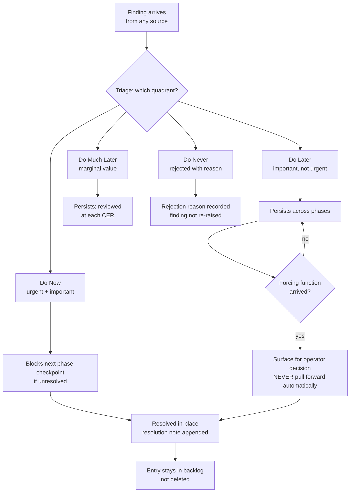
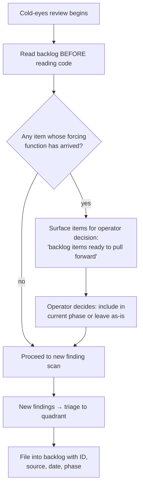

# CER Backlog + Living Backlog Phases

> **One-line intent:** A quadrant triage log (Do Now / Do Later / Do Much Later / Do Never) where every finding from any review source files into one of four buckets and is never deleted — resolved findings stay in place with a resolution note — so teams stop re-discovering the same issues quarterly.

## Pattern in 60 Seconds

_The entire pattern distilled into something anyone can read in under a minute. No jargon, no code. A CEO, an engineer, and an entrepreneur should all understand this section._

**The problem:** Security audits, code reviews, and operator observations generate more findings than a team can act on immediately. The low-priority findings go into a Slack message or a comment thread, which gets archived. Six months later, a new audit re-discovers the exact same issues — because nobody recorded that the issues were already known.

**The insight:** A quadrant log with a no-delete policy means every finding survives the moment it was raised. When a team does a new review, they start by reading the backlog, not by scanning the code from scratch. Findings that were "not urgent" last quarter might have a forcing function this quarter — and the backlog is what connects them.

**CER stands for Cold-Eyes Review** — a structured adversarial review session where a reviewer reads the project without prior context, as if seeing it for the first time. Findings from CERs, security audits, operator observations, and intent reviews all file into the same backlog under a shared ID scheme (CER-001, CER-002, etc.).

**The key structure — four quadrants:**

| Quadrant | Meaning | Example |
|----------|---------|---------|
| **Do Now** | Urgent and important. Blocks correctness, security, or the next phase. | CER-027: context-check enforcement was attention-only; risk of in-flight work loss |
| **Do Later** | Important but not urgent. Quality improvements, architectural refinements. | CER-009: pipe path validation gap — real but low exploitability |
| **Do Much Later** | Not urgent, marginal value. Style, cosmetics, speculative improvements. | (none in flex at time of writing) |
| **Do Never** | Rejected findings. Rejection reason recorded so the issue is not re-raised. | (none in flex at time of writing) |

**What broke when we got this wrong:** CER-009 (Phase 17) identified a pipe path validation gap in three hook scripts. The finding was partially resolved. Eleven phases later, a Phase 28 security audit surfaced CER-020: the same gap in a fourth hook script that was not in scope when CER-009 was originally filed. The backlog entry for CER-009 — which persisted even after its partial resolution — was what connected the two findings across 11 phases and prevented CER-020 from looking like a brand-new issue requiring full re-investigation.

---

## Classification

| Property | Value |
|----------|-------|
| **Category** | Operations & Orchestration |
| **Difficulty** | Intermediate |
| **Also Known As** | Quadrant Finding Log, Living Engineering Backlog, CER (Cold-Eyes Review) Backlog |

---

## Motivation

Imagine a security auditor reviews a system and finds five issues. Three are actionable immediately: they block the current release and get filed as Do Now. Two are real but low-priority: they are edge cases with low exploitability in the current threat model.

Without this pattern: the two low-priority findings go into a review summary document, which gets attached to a Jira ticket, which gets closed when the three Do Now items ship. Six months later, a new auditor reviews the same system. They find the two low-priority issues. Nobody remembers they were already known. The team has to re-triage them, re-research them, and re-document their risk profile. The audit costs twice as much work for findings that were already understood.

With this pattern: all five findings go into the backlog. The two low-priority ones are triaged to Do Later with a one-line explanation of why they are not urgent today. At every subsequent review, the orchestrator opens the backlog before reading any code and checks whether any Do Later item's forcing function has arrived — is it now low-effort given the current diff? Is it related to a new finding? If yes, it is surfaced for operator decision before any new work begins.

The forcing function concept is what makes the pattern valuable over time. CER-009 in the flex project identified a pipe path validation gap in three hook scripts (`stop.py`, `post_tool_use.py`, `session_end.py`). It was filed as Do Later — real but low severity (no secrets in payloads, write silently drops on ENXIO). Eleven phases later, Phase 28 introduced a security audit of `exit_plan_mode.py`. The auditor checked the CER backlog, saw CER-009, and immediately recognized that `exit_plan_mode.py` had the same gap — it was not included in CER-009's fix. CER-020 was filed referencing CER-009, resolved in Phase 30 as INFRA-068. The connection across 11 phases was only visible because CER-009 was still in the backlog with its resolution note intact.

---

## Applicability

Use this pattern when:
- A project spans multiple phases or months
- Security audits or cold-eyes reviews generate more findings than can be acted on immediately
- You want a history of every finding including resolved ones, so future reviewers know what was considered and why
- You need to explain to a future reviewer — human or AI — why a known issue was not fixed at a given point in time
- The team runs periodic reviews and needs a way to check whether previously deferred items are now ready to action

Do NOT use this pattern when:
- The project is a single-session throwaway with no follow-on work
- The total finding count is small enough to track in the phase doc itself (fewer than approximately five findings total)
- There is no recurring review cadence — if nobody will ever read the backlog again, the overhead of maintaining it is not justified

---

## Structure

_Finding lifecycle — how a finding enters the backlog, moves between quadrants, and is resolved._



_Backlog grooming — what happens at every cold-eyes review._



---

## Participants

| Participant | Role | Example |
|------------|------|---------|
| **CER Backlog file** | The single durable file that holds all findings in all quadrants. Never truncated. Resolved findings remain in place with resolution notes. | `docs/cer/backlog.md` in the flex project |
| **Orchestrator** | The agent or human who runs each review session. Reads the backlog before scanning code; triages new findings to quadrants; surfaces forcing-function items for operator decision. | The flex session orchestrator at each phase checkpoint |
| **Security auditor** | A reviewer — AI or human — who reads the codebase adversarially and produces findings. Findings are filed into the backlog, not into a separate audit report that gets archived. | Phase 17 security audit that produced CER-009 |
| **Intent reviewer** | A reviewer who checks whether the implementation matches its stated intent — not just whether it is secure. Distinct from a security auditor: focuses on contract fidelity, not attack surface. | Phase 15 intent review that produced CER-006 and CER-007 |
| **Operator** | The human who decides whether a forcing-function item is pulled into the current phase. The pattern never pulls items forward automatically — the operator always decides. | david@halfhorse.com deciding on each CER item at phase boundary |
| **Quadrant triage rule** | The classification criterion for each quadrant (urgent+important → Do Now, important+not urgent → Do Later, etc.). The orchestrator applies this rule at filing time. | The four-quadrant table in this pattern's Structure section |
| **Resolution note** | A short in-place note appended to the finding row when the finding is resolved. Records the phase and story that resolved it. The original finding text is not modified. | "RESOLVED Phase 28 INFRA-062" appended to CER-009 |
| **No-delete policy** | The rule that findings are never removed from the backlog. Resolved findings stay with their resolution note. Do Never findings stay with their rejection reason. | Encoded as file-level policy in `docs/cer/backlog.md` |

---

## How It Works

The following policies are the canonical enforcement authorities for this pattern. They live in the global `CLAUDE.md` under `## Living backlog phases` and `## Backlog grooming on every cold-eyes review` and apply to every project and every session:

---

**Living backlog phases:**

> Projects that use a Do Later / Do Much Later / Do Never backlog structure
> (phase docs named accordingly) treat those files as living backlogs:
>
> - Any finding from a build, review, security audit, or external report that
>   is not being built immediately goes into the appropriate backlog phase.
> - This is an ongoing policy, not a one-time sort. Apply it to everything that
>   surfaces, not just the items on the table when the instruction was first given.

**Backlog grooming on every cold-eyes review:**

> Whenever a cold-eyes review (external or internal) generates a list of Do Now
> fixes, also read the project's backlog phases (Do Later, Do Much Later) and
> identify any items whose forcing function has arrived — items that are now
> low-effort given the current diff, or directly related to the review's findings.
>
> Present them as "backlog items ready to pull forward" alongside the Do Now list.
> Let the user decide which to include in the current remediation phase.
>
> Never pull backlog items into a build automatically — always surface and ask.

---

Operationally, the orchestrator follows these numbered steps:

1. **Every finding gets a unique ID (CER-NNN) and files into one of the four quadrants.** The filing happens at the time of the review session, before any work begins on the current phase.

2. **Findings are never deleted.** When a finding is resolved, a resolution note is appended in-place: the phase, the story ID, and a one-line summary of what was done. The original finding text is left intact. This preserves the investigation context for future reviewers.

3. **Do Now findings block the next phase checkpoint if unresolved.** The checkpoint sequence checks the Do Now quadrant before tagging. An unresolved Do Now entry is a hard blocker — the phase cannot be checkpointed until the finding is resolved (or explicitly retriage to a lower-urgency quadrant with a documented reason).

4. **At every cold-eyes review: read the backlog before reading code.** The orchestrator opens the backlog file, scans all four quadrants, and identifies any item whose forcing function has arrived. "Forcing function arrived" means: the item is now low-effort given the current diff, or it is directly related to one of the new findings from this review. These items are presented to the operator as "backlog items ready to pull forward" alongside the new Do Now list.

5. **The operator decides whether to pull forward.** The orchestrator never promotes a Do Later item to Do Now without explicit operator approval. This preserves the deliberateness of the original triage decision and prevents scope creep from backlog grooming.

6. **Do Never entries record the rejection reason.** When a finding is classified as Do Never, the rejection reason is written into the entry. This prevents the same finding from being re-raised by a future auditor who does not know the original disposition. A future reviewer who sees a Do Never entry can immediately understand why the issue was rejected, rather than re-investigating it.

### Configuration Example

A minimal CER backlog entry showing the filing format and resolution note pattern:

```markdown
| ID | Finding | Source | Date | Phase |
|----|---------|--------|------|-------|
| CER-009 | hooks/stop.py, post_tool_use.py, session_end.py: PIPE_PATH defaults to
  hardcoded "/tmp/companion.pipe" and is then conditionally overridden by reading
  pipe_path from .companion/state.json (relative path). A crafted state.json could
  redirect pipe writes to an arbitrary path. No secrets in payloads; write silently
  drops on ENXIO if no FIFO reader. LOW severity. | Security audit cp17 | 2026-04-30 | 17 |
  **RESOLVED** Phase 28 INFRA-062 |
```

The key structural properties: unique ID in the first column, original finding text preserved verbatim, resolution note appended to the Phase column (not replacing it), source and date recorded for traceability.

A Do Never entry:

```markdown
| ID | Finding | Source | Date | Phase | Resolution |
|----|---------|--------|------|-------|------------|
| CER-NNN | [finding text] | [source] | [date] | [phase] | **DO NEVER** — [reason why this is not worth fixing; what would have to be true for this to become relevant] |
```

---

## Consequences

### Benefits

- No finding is ever silently lost. Every finding that was raised is in the backlog — either resolved with an audit trail, or explicitly deferred with a reason.
- Re-discovery is eliminated. Before any new review session begins, the orchestrator reads the backlog. If the new finding has a cousin in the Do Later quadrant, the connection is immediate — not reconstructed from months of history.
- The backlog is auditable history. A future reviewer can answer "was this issue previously known?" with a single file read. They can see when it was filed, from which review source, what the original triage decision was, and when it was resolved.
- Checkpoint gates can reference it. The Do Now quadrant functions as an implicit escalation register: any finding that cannot wait for the next phase goes there, and the gate checks it before allowing the phase to close.
- Future reviewers see what was considered and why. Do Never entries prevent the same proposal from recurring in every audit cycle. Do Later entries explain why a known issue was not acted on immediately.

### Liabilities

- The backlog grows indefinitely. There is no pruning mechanism — Do Never and resolved entries stay forever. For a long-lived project, the backlog file becomes large. In practice this is acceptable: the file is human-readable and grep-friendly, and the entries are append-only.
- Requires discipline to triage rather than file everything as Do Now. An orchestrator that puts every finding in Do Now defeats the quadrant system — Do Now becomes a long list that nobody acts on, which is worse than having no structure. Triage discipline must be enforced by the orchestrator, not the file format.
- May feel bureaucratic for small projects. For a single-session prototype with two or three findings, tracking them in the phase doc is lighter weight and sufficient. This pattern is overhead for small finding volumes.

### What Broke in Practice

**CER-009 → CER-020 re-discovery (Phases 17 and 28):** CER-009 (Phase 17) identified a pipe path validation gap in `hooks/stop.py`, `post_tool_use.py`, and `session_end.py`. These three files were fixed in Phase 28 as INFRA-062. The resolution note was appended to the CER-009 entry: "RESOLVED Phase 28 INFRA-062." The entry was not deleted. Eleven phases later, the Phase 28 security audit was reviewing `exit_plan_mode.py`. The auditor checked the CER backlog and saw CER-009: the same pattern — reading `pipe_path` from `state.json` without validating that the resolved path falls under `tempfile.gettempdir()`. `exit_plan_mode.py` was not in scope when CER-009 was originally filed and was not included in INFRA-062. CER-020 was filed immediately referencing CER-009's fix pattern, and resolved in Phase 30 as INFRA-068.

Without the backlog: CER-020 would have been filed as if it were a new, unrelated issue. The auditor would have needed to independently investigate the pipe path pattern from scratch, determine the risk profile, design a fix, and document the resolution — duplicating all of the work already done for CER-009. With the backlog: the connection was immediate, the fix pattern was already documented, and the resolution required only applying the same `_resolve_pipe_path` pattern from INFRA-062 to the fourth hook script.

**CER-027 — Do Now blocking its own resolution (Phase 47):** CER-027 identified that the pairmode build loop's context budget check was enforced only by LLM attention — the rule lived in a doc the orchestrator was expected to honor each iteration. Filed as Do Now on 2026-05-29 after an operator observation confirmed the failure mode: the orchestrator moved quickly through stories, skipped the check, context bloated past the 120k-token threshold. The Do Now classification meant Phase 47 could not be checkpointed until CER-027 was resolved. It was resolved in the same phase: INFRA-127 (the `context_budget.py` enforcement module), INFRA-128 (the `pre_tool_use.py` hook delegate), and INFRA-129 (the template prose replacement). The resolution note remains in the backlog — preserving the audit trail that Phase 47 had an open enforcement gap and closed it before tagging checkpoint cp47.

---

## Implementation Notes

### Variations

- **Separate backlog file per project vs. shared policy file:** The flex project uses a single `docs/cer/backlog.md` per project repository, with the quadrant triage policy living in the global `~/.claude/CLAUDE.md`. Downstream projects (forqsite, radar, asp, aab, cora) each have their own backlog files with findings specific to that project. The policy is shared; the entries are per-project.

- **CER ID scheme:** The flex project uses sequential global IDs (CER-001, CER-002, ...) across all quadrants. An alternative is per-quadrant IDs (DN-001 for Do Now, DL-001 for Do Later) — this makes the quadrant visible in the ID itself. The tradeoff: global IDs are simpler to cross-reference across quadrant movements; per-quadrant IDs make the current quadrant self-documenting in any reference.

- **Retriage is explicit:** A finding can move between quadrants. CER-028 in the flex project was filed as Do Now at Phase 47, then retriage to Do Later with an explicit note: "Requires semantic decision; not a correctness bug. Neither command is wrong — they're different in scope. Pull forward when the reviewer checklist is next revised." The original Do Now entry is retained; the retriage decision and date are appended as a note in the resolution/status field. This preserves the history of the triage decision.

### Common Pitfalls

- **Filing everything as Do Now.** If every finding is urgent, none of them are. The Do Now quadrant is meaningful only if it is reserved for findings that genuinely block the next phase. An orchestrator that reflexively files all findings as Do Now will eventually stop reading the backlog because it has become a long list of unacted-on items — the same failure mode as having no backlog.
- **Deleting resolved entries.** The temptation is to remove resolved findings to keep the file short. This destroys the audit trail. Future reviewers who encounter the same code area will not know the issue was previously investigated, re-file it, and waste time re-triaging a known quantity.
- **Skipping the backlog read at review start.** The backlog grooming policy requires reading the backlog before reading code. An orchestrator that starts each review by scanning the codebase from scratch and only checks the backlog after generating a list of new findings will miss forcing-function connections — the new finding that would have surfaced a Do Later item as ready for promotion.
- **Writing only "RESOLVED" without a resolution note.** "RESOLVED" alone tells a future reviewer that the finding was addressed, but not where or how. The resolution note must include the phase and story ID (e.g., "RESOLVED Phase 28 INFRA-062") so a reviewer can trace back to the exact commit and understand what was done.

---

## Security Implications

### Attack Surface

- The CER backlog is an internal project record stored in version control. It does not introduce a network-accessible attack surface.
- The backlog file is Markdown with a simple table structure. There is no parsing layer that could be exploited. Findings are plain text; no executable content is stored.

### Data Sensitivity

- CER backlog entries describe security vulnerabilities, architectural gaps, and enforcement failures in the project's code. These are internal findings and should be treated with the same access controls as the rest of the codebase. The backlog should not be published without review.
- The backlog does not store credentials, tokens, or user data. If a finding touches a credential or secret, the entry should describe the gap abstractly (e.g., "path traversal in script X allows reading arbitrary files") without reproducing the credential or the attack payload.
- Severity levels in the backlog (HIGH, MEDIUM, LOW) are internal classifications, not public disclosures. A Do Now entry with HIGH severity does not imply the vulnerability is being exploited — it means the project has decided to resolve it before the next phase checkpoint.

### Failure Modes

- **Backlog grows stale and nobody reads it.** The most dangerous failure mode. A backlog that is filed into but never read at review time is a write-only log: it provides no forcing-function benefit and may give false confidence that findings are "tracked." Mitigation: the backlog grooming policy makes reading the backlog the first step of every cold-eyes review — not a voluntary action but a required step before any new scan begins.
- **Do Now entries not checked at checkpoint.** If the checkpoint sequence does not include a Do Now backlog review, a finding can remain open through a checkpoint and into the next phase without anyone noticing. Mitigation: the `CLAUDE.build.md` checkpoint sequence includes an explicit CER backlog review step — a phase cannot be tagged if there are open Do Now entries.
- **Finding filed without quadrant triage.** A finding that is logged but not assigned to a quadrant is invisible to the grooming process. The four-quadrant table structure enforces a quadrant decision at filing time: there is no "inbox" row that skips triage.

### Mitigations

- Encode the backlog read as the first step of every cold-eyes review session — not as a reminder but as a written step in the review runbook. The policy cannot rely on the reviewer remembering to do it; it must be part of a documented sequence.
- Checkpoint gates must include an explicit Do Now check. The gate is effective only if it is part of a written sequence that the orchestrator follows every time — not a post-hoc suggestion.
- Keep the backlog in version control alongside code. The git history of the backlog file is an audit trail of every filing and resolution. A finding that was silently removed is visible in git history; a resolution note that was backdated is visible in commit timestamps.

---

## Known Uses

| Organization | Context | Scale |
|-------------|---------|-------|
| flex project, operated by david@halfhorse.com | Pairmode build loop across Phases 10–47; CER backlog at `docs/cer/backlog.md` with entries CER-001 through CER-030+; every security audit, intent review, and operator observation files into the quadrant triage log | 1 primary repo + 5 downstream projects (forqsite, radar, asp, aab, cora); 30+ CER entries spanning 35+ phases |

---

## Related Patterns

| Pattern | Relationship |
|---------|-------------|
| `eod-reconciliation` | Both patterns reconcile against evidence at a defined cadence. `eod-reconciliation` reconciles operational events against expected outcomes; the CER Backlog reconciles code findings against the project's ongoing state. Both maintain a persistent record that survives the session. |
| `escalation-chain-with-sla` | Both surface stalls. The CER Backlog's Do Now quadrant is an implicit escalation mechanism: a finding classified Do Now blocks the phase checkpoint until resolved, creating a hard SLA without requiring a separate escalation chain. |
| `phase-spec-pause-resume` (NP-2) | The two patterns compose at the checkpoint gate: `phase-spec-pause-resume` checks that all planned stories are either complete or formally deferred before tagging; the CER Backlog pattern adds the requirement that all Do Now entries are resolved. Both must pass before a phase can be checkpointed. The checkpoint sequence in `CLAUDE.build.md` runs both checks sequentially. |

---

## Metadata

| Property | Value |
|----------|-------|
| **Contributor** | David Jacobsen, flex project (david@halfhorse.com) |
| **Production Environment** | Local agentic development, Claude Code plugin, Python/Anthropic SDK |
| **First Published** | 2026-05-31 |
| **Last Updated** | 2026-05-31 |
| **Cloud Nirvana Event** | — |
| **License** | CC BY 4.0 |

---

## Revision History

| Date | Change | Author |
|------|--------|--------|
| 2026-05-31 | Initial publication | David Jacobsen |
