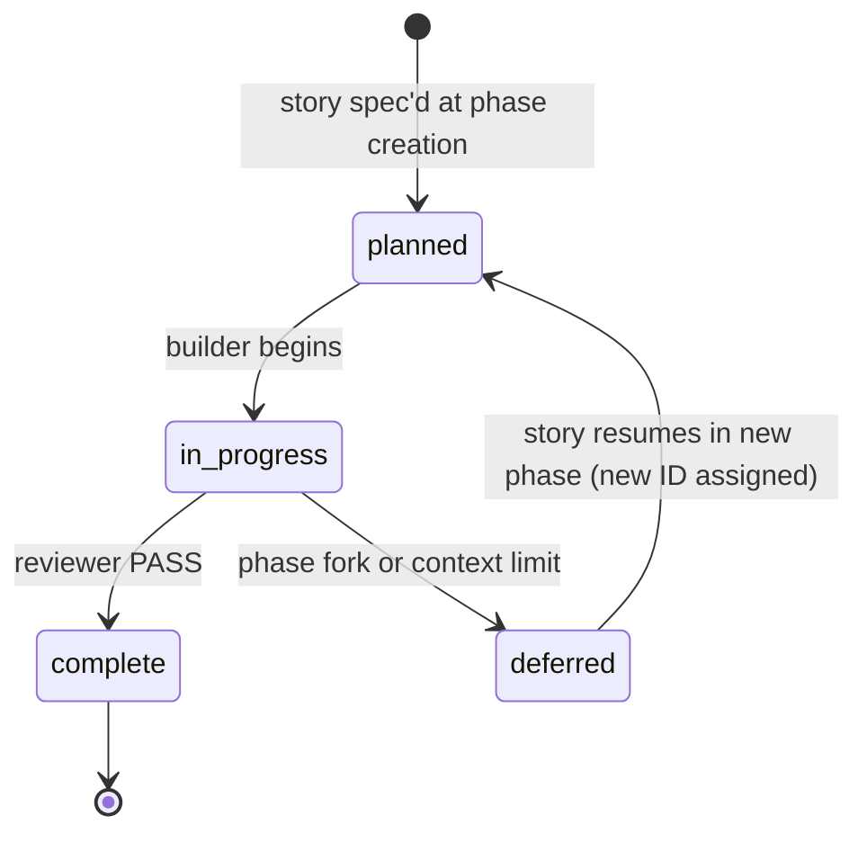
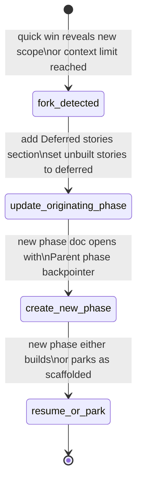

# Phase Spec with Formal Pause/Resume

> **One-line intent:** Phase docs function as living specs with an explicit story state machine (`planned → in_progress → complete | deferred`) so that multi-phase initiatives never lose continuity across forks, context clears, or agent handoffs.

## Pattern in 60 Seconds

_The entire pattern distilled into something anyone can read in under a minute. No jargon, no code. A CEO, an engineer, and an entrepreneur should all understand this section._

**The problem:** Long-running AI-driven projects span many sessions. When a session ends mid-phase — whether by context limit, urgent pivot, or deliberate fork — the next session has no canonical record of what was done, what was deferred, and why.

**The insight:** A phase document with a simple four-state story machine (`planned → in_progress → complete | deferred`) is the single durable authority that survives any session boundary. If the doc is updated before the session ends, the next session resumes from an exact point.

**The key structure:**

| State | Meaning | Who Sets It |
|-------|---------|-------------|
| `planned` | Story is spec'd but not yet started | Orchestrator at phase creation |
| `in_progress` | Story is actively being built | Orchestrator when builder begins |
| `complete` | Story passed reviewer; deliverable committed | Orchestrator on PASS verdict |
| `deferred` | Story was not built; intentionally parked in a new phase | Orchestrator at fork time |

**What broke when we got this wrong:** On 2026-05-29 the context window hit 155k tokens mid-Phase 47. Without the resume marker written to the phase doc before the clear, the next session would have had no record of which tracks were spec'd, which decisions were in flight, or what the recommended continuation sequence was. The resume marker preserved all of it and made the second session possible.

---

## Classification

| Property | Value |
|----------|-------|
| **Category** | Operations & Orchestration |
| **Difficulty** | Intermediate |
| **Also Known As** | Living Phase Manifest, Story State Machine, Formal Spec Continuity |

---

## Motivation

Imagine an agent is building Phase 5 of a three-month initiative. The phase has ten stories split across two architectural rails — INFRA for infrastructure work and PATTERNS for pattern publication work. The agent completes six stories across both rails, then the context window fills at 155k tokens. A new session starts.

Without this pattern, the new session asks "what's left?" and gets at best a memory summary — incomplete, possibly stale, and with no record of the decisions that were already made. The new session re-investigates tracks that were already investigated, re-asks questions that were already answered, and may duplicate or contradict the work already committed.

With this pattern, the new session opens the phase doc. It sees exactly which stories are `complete`, which are `in_progress`, and which are `planned`. The resume marker in the phase doc preserves the orchestrator's recommended continuation sequence and any open decisions. The new session continues from an exact point, with no rework.

The same durability applies to intentional forks. When Phase 47 surfaced open-patterns publication scope that wasn't in its original mandate, that work was immediately parked in a new Phase 48 doc with a `**Parent phase:**` backpointer. Phase 47's Stories table was not left claiming all planned stories were complete. The originating phase doc became the historical record; the new phase became the forward-looking spec.

This discipline is lightweight per story — a single field update plus a one-line note — but the compound effect across a long project is that cold-eyes reviewers, new agents, and returning human engineers can all reconstruct the full history of every decision point without reading months of conversation transcripts.

---

## Applicability

Use this pattern when:
- A project spans multiple sessions or multiple months
- A phase contains more than one story
- Context clears are possible (any long-running agentic project)
- Work may need to be forked into a new phase mid-flight
- Multiple agents (builder, reviewer, orchestrator) hand off control of the same phase

Do NOT use this pattern when:
- A phase contains a single hotfix story where the story IS the phase
- A throwaway exploratory session has no deliverable
- All stories in a phase complete within one session and no fork is anticipated

---

## Structure

_Story state machine — the core state diagram governing individual story lifecycle._



_Every story in a phase doc moves through this machine. The orchestrator owns all transitions. `deferred` is not failure — it is an explicit, audited parking decision._

---

_Phase fork ceremony — the sequence of writes required before starting a new phase._



_The fork ceremony is not optional. A phase doc with silently abandoned `planned` stories cannot be checkpointed._

---

## Participants

| Participant | Role | Example |
|------------|------|---------|
| **Phase doc** | The living spec — single source of truth for all story states within a phase. Persists across sessions, context clears, and agent handoffs. | `docs/phases/phase-47.md` |
| **Story file** | The detailed spec for a single story, including acceptance criteria, primary files, and touches. Linked from the phase doc's Stories table. | `docs/stories/INFRA/INFRA-127.md` |
| **Rail** | The architectural domain grouping that partitions stories within a phase (e.g., INFRA for infrastructure work, PATTERNS for pattern publication work). Each rail has its own story number sequence. | INFRA rail, PATTERNS rail in Phase 48 |
| **Checkpoint tag** | A git tag marking a phase as fully complete — all stories either `complete` or formally `deferred`. The checkpoint gate blocks tagging until this condition is satisfied. | `cp47-pairmode-methodology-consolidation` |
| **CER backlog** | The Continuous Engineering Record backlog (`docs/cer/backlog.md`). Failure modes that surface during a phase go here; the checkpoint sequence reviews it before tagging. | CER-027 — context-check enforcement |
| **Orchestrator** | The agent or human who owns the phase doc, drives story state transitions, and performs the fork ceremony when required. | The session that wrote the Phase 47 resume marker before context clear |
| **Deferred stories section** | A `## Deferred stories` block added to the originating phase doc at fork time, listing each unbuilt story, the one-line deferral reason, and where it will be resumed. | Phase 47's Deferred stories section pointing to Phase 48 |
| **Parent phase backpointer** | The `**Parent phase:**` line on line 1 of the new (forked) phase doc, naming the originating phase and what it left behind. | Phase 48 line 10: `**Parent phase:** Phase 47 ...` |

---

## How It Works

The rule governing this pattern:

---

> When a quick win inside a phase reveals a follow-on need that becomes a new phase,
> or an urgent finding forces a pivot before the current phase is complete, the
> in-progress phase must be formally paused — not silently abandoned.
>
> **At fork time — before starting the new phase:**
>
> 1. In the originating phase doc, add a `## Deferred stories` section listing each
>    unbuilt planned story, a one-line reason it was deferred, and where it will be
>    resumed (e.g., "Resumed in Phase N").
> 2. In the phase Stories table, update each deferred story's status from `planned`
>    to `deferred`.
> 3. The new (forked) phase doc must open with a `**Parent phase:**` line naming the
>    originating phase and what it left behind.
>
> **At resume time — when returning to deferred work:**
>
> The resuming phase doc references the originating phase: "Picks up deferred stories
> from Phase N." Stories get new IDs in the resuming phase; the originating phase doc
> remains the historical record for the original IDs.
>
> **Checkpoint gate:**
>
> A phase cannot be checkpointed with silently abandoned `planned` stories. Before
> tagging, verify all planned stories in the phase manifest are either `complete` or
> formally deferred (with a `## Deferred stories` note in the phase doc). The checkpoint
> sequence in `CLAUDE.build.md` enforces this as an explicit step (Phase completion check)
> between Documentation review and CER backlog review.

---

Operationally, the orchestrator follows these numbered steps:

1. **Phase creation:** Every story begins in `planned` state in the phase Stories table. The orchestrator writes the phase doc before any building begins.
2. **Story start:** When a builder begins a story, the orchestrator updates its state to `in_progress`.
3. **Story completion:** On reviewer PASS verdict, the orchestrator sets the story to `complete`.
4. **Fork detected:** When scope expands beyond the phase mandate or a context limit is reached, the orchestrator performs the fork ceremony before creating the new phase doc.
5. **Fork ceremony — originating phase:** Add `## Deferred stories` section. List each unbuilt story with a one-line reason and the phase where it will resume. Update each deferred story's status in the Stories table from `planned` to `deferred`.
6. **Fork ceremony — new phase:** Open the new phase doc with a `**Parent phase:**` line on line 1. Park or begin building per the new phase's mandate.
7. **Resume:** The resuming phase doc opens with "Picks up deferred stories from Phase N." Stories get new IDs in the resuming phase. The originating phase doc remains the historical record for the original IDs.
8. **Checkpoint gate:** Before tagging, the orchestrator verifies that every story in the originating phase manifest is either `complete` or `deferred` (with an explicit `## Deferred stories` entry). No `planned` story may be silently absent at tag time.

### Code / Configuration Example

A minimal phase doc Stories table showing all four states in a real phase:

```markdown
## Stories

| ID | Rail | Title | Status |
|----|------|-------|--------|
| INFRA-124 | INFRA | Sync defect — schema gate | complete |
| INFRA-125 | INFRA | Override boilerplate | complete |
| INFRA-126 | INFRA | DOC CURRENCY pointer | complete |
| INFRA-127 | INFRA | CER-027 pre-tool hook | complete |
| PATTERNS-001 | PATTERNS | Builder-reviewer pattern doc | complete |
| PATTERNS-002 | PATTERNS | Phase spec pause-resume pattern doc | in_progress |
| PATTERNS-003 | PATTERNS | Checkpoint-gated autonomy pattern doc | deferred |

## Deferred stories

| ID | Reason | Resumed in |
|----|--------|------------|
| PATTERNS-003 | Phase scope capped at 2 pattern docs for initial publication; PATTERNS-003 is net-new scope | Phase 49 |
```

The `## Deferred stories` section makes the absence of PATTERNS-003 in Phase N's deliverable an audited decision, not a silent omission. A cold-eyes reviewer can immediately verify: was PATTERNS-003 done (no — it is `deferred`) and where does it land (Phase 49).

A forked phase doc opens with:

```markdown
# flex — Phase 49: [title]

← [Phase 48: Open-patterns publication initiative](phase-48.md)

**Parent phase:** Phase 48 — picks up PATTERNS-003 (checkpoint-gated autonomy pattern doc) deferred from Phase 48's Stories table.
```

---

## Consequences

### Benefits
- Any session — new agent, returning human, cold-eyes reviewer — can resume from an exact state by reading one file.
- Fork decisions are audit-trailed: the originating phase doc records what was deferred, why, and where it goes.
- Cold-eyes reviews can definitively answer "was this done or dropped?" without reading months of conversation transcripts.
- The checkpoint gate blocks tagging until all scope is either shipped or formally parked, preventing invisible technical debt accumulation.
- The pattern integrates naturally with version control: the phase doc's git history is a complete record of every state transition.

### Liabilities
- Requires discipline from the orchestrator to update state on every transition. If the orchestrator skips updates, the phase doc diverges from reality.
- Overhead per story: roughly two field updates (state change at start, state change at end) plus one entry in `## Deferred stories` if deferred.
- Phase docs grow large in long projects. After 12+ stories the Stories table requires scrolling; consider splitting very large phases into sub-phases earlier.

### What Broke in Practice

- **Phase 47 context clear (2026-05-29, CER-027):** At 155k tokens the context was cleared mid-phase. The resume marker written to `docs/phases/phase-47.md` before the clear preserved: which tracks were spec'd, which had decisions in flight, the recommended continuation sequence (T6 → T2 → T5 → T1 → T7), and the open CER-027 question. Without it, the next session would have had to re-investigate every track. The clear itself was an instance of CER-027's failure mode — the pattern's resume discipline converted a potential loss into a clean handoff.

- **Silently abandoned stories (pre-pattern):** Before the formal Deferred stories discipline was enforced, stories that ran out of time at phase end would simply not appear in the next phase doc. Reviewers could not distinguish "was this done?" from "was this dropped?" When re-discovered in a later cold-eyes review, reconstructing intent required reading months of phase history. The pattern eliminates this ambiguity: a story that is not in the next phase's Stories table and has no `## Deferred stories` entry in the originating phase is a process violation, detectable immediately.

- **Fork without backpointer:** When Phase 48 was forked from Phase 47's review (to capture open-patterns publication scope), the `**Parent phase:**` backpointer and `## Deferred stories` section were mandatory writes. Without them, Phase 47's historical record would have implied all its planned stories were complete — they weren't: Phase 48's net-new scope was surfaced during Phase 47's review. The backpointer preserves the causal chain: why Phase 48 exists, and what Phase 47 left behind.

---

## Implementation Notes

### Variations

- **Resume marker variant:** For context-clear scenarios, the orchestrator writes a `## Resume marker` block in the phase doc before the context is cleared. This block captures the full in-flight state — decisions made, tracks completed, open questions, recommended next step — in prose form. The resume marker is a superset of the Stories table; it preserves intent that doesn't fit in a state field. In the flex project's Phase 47, a context clear occurred mid-phase at 155k tokens — itself an instance of the CER-027 failure mode being addressed in that same phase. The resume marker recorded the state of all seven active work tracks, the CER backlog entries, two branching paths forward with a recommendation, and which artifacts were on disk vs. recoverable. The fresh session resumed without re-deriving any context and resolved the CER-027 track first as recommended.

- **Rail-partitioned Stories table:** In phases with many stories across multiple rails, the Stories table can be partitioned by rail with sub-headers. Each rail maintains its own story number sequence (INFRA-NNN, PATTERNS-NNN). Rail partitioning makes it easy to see at a glance which architectural domain has open work.

- **Scaffolded-but-not-in-queue variant:** A phase doc can be created with all stories in `planned` state but explicitly marked `NOT in build queue` in the status line. This parks scope without claiming it is being built. Phase 48 uses this variant: created 2026-05-29 as a parking lot for publication scope while Phase 47 completes.

### Common Pitfalls

- **Updating the state machine inconsistently:** If the orchestrator updates `complete` in the story file but forgets to update the phase doc's Stories table, reviewers will see a mismatch. Treat the phase doc as the authoritative state; the story file's YAML frontmatter is secondary.
- **Skipping the checkpoint gate:** The gate exists because phase docs are easy to checkpoint prematurely. Resist the urge to tag before verifying every story. The gate is the last line of defense against invisible deferred work.
- **Conflating `deferred` with `failed`:** `deferred` is a first-class outcome. A story that is deliberately parked because scope shifted is not a failure — it is evidence that the pattern is working. Treat it as such in retros and reports.
- **Omitting the one-line reason in `## Deferred stories`:** The reason is what allows future sessions and reviewers to understand whether the deferral was deliberate or accidental. "Out of scope for this phase" is sufficient; the absence of any reason is not.

---

## Security Implications

### Attack Surface

- Phase docs are internal project records stored in version control. They do not introduce a network-accessible attack surface.
- The state machine fields (`planned`, `in_progress`, `complete`, `deferred`) are plain text in Markdown tables. There is no parsing layer that could be exploited.

### Data Sensitivity

- Phase docs may reference internal project names, CER identifiers, team members, and architectural decisions. They should be treated with the same access controls as the rest of the codebase.
- No credentials, tokens, or user data should ever appear in a phase doc. If a phase doc records a finding that touches credentials, it should reference the CER entry, not reproduce the credential.

### Failure Modes

- **Phase doc diverges from code:** The most dangerous failure mode is a phase doc that says `complete` for a story whose deliverable was never committed. The checkpoint gate partially mitigates this by requiring BUILD GATE (test suite) to pass before tagging, but the gate does not verify that every `complete` story's deliverable is actually present on disk.
- **Deferred stories lost between phases:** If a `## Deferred stories` entry is created but the target phase is never opened, the deferred work silently disappears. Mitigation: the CER backlog (`docs/cer/backlog.md`) records any deferral that spans more than one phase boundary; a cold-eyes review of the backlog at each phase start catches stranded deferred stories.
- **Checkpoint tag applied without gate:** If the checkpoint tag is applied manually, bypassing the checkpoint sequence, silently abandoned `planned` stories can survive into the historical record as apparent completions. Mitigation: checkpoint tags are created by the orchestrator following the explicit checkpoint sequence in `CLAUDE.build.md`, which includes the Phase completion check as a mandatory step.

### Mitigations

- Enforce the checkpoint gate as a documented, explicit step in `CLAUDE.build.md` — not as an informal reminder. The gate is effective only if it is part of a written sequence that the orchestrator follows.
- Review the `## Deferred stories` sections of recent phase docs at the start of each cold-eyes review. Any deferred story that has been parked for more than two phases without a home is a signal that the work was effectively abandoned; surface it for a deliberate keep/drop decision.
- Keep phase docs in version control alongside code. The git history of a phase doc is an audit trail of every state transition; it can be inspected to verify that no story was silently moved from `planned` to absent.

---

## Known Uses

| Organization | Context | Scale |
|-------------|---------|-------|
| flex project — 5 downstream projects (forqsite, radar, asp, aab, cora) | Used across Phases 10–47. Global policy encoded in `~/.claude/CLAUDE.md` "Phase continuity" section. The Phase 47 resume marker (CER-027 context clear, 2026-05-29) is the canonical production example of the pattern saving a multi-month initiative from a mid-phase context loss. | Team |

---

## Related Patterns

| Pattern | Relationship |
|---------|-------------|
| `runbook-driven-agent-cadence` | Both separate spec from execution. In this pattern, the phase doc itself functions as the runbook — the living spec that the agent follows rather than a separate procedure file. |
| `checkpoint-gated-autonomy` | This pattern's checkpoint gate IS the autonomy gate for phase completion. A phase cannot be tagged (autonomy granted to close it) until the checkpoint gate verifies the story state machine is clean. |
| `builder-reviewer-sub-agent-loop` (NP-1) | The builder/reviewer loop operates within phases governed by this pattern. Each loop iteration advances one story through the state machine; the phase doc is the persistent record of all iterations. |

---

## Metadata

| Property | Value |
|----------|-------|
| **Contributor** | David Jacobsen, flex project (david@halfhorse.com) |
| **Production Environment** | Local agentic development, Claude Code plugin, Python/Anthropic SDK |
| **First Published** | 2026-05-31 |
| **Last Updated** | 2026-05-31 |
| **Cloud Nirvana Event** | — |
| **License** | CC BY 4.0 |

---

## Revision History

| Date | Change | Author |
|------|--------|--------|
| 2026-05-31 | Initial publication | David Jacobsen |
